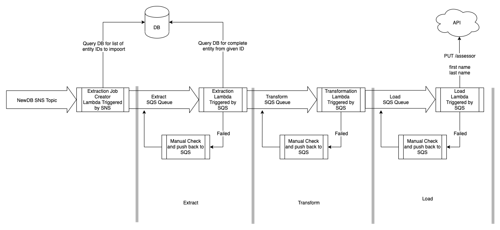

# ETL Pipeline


This repository is responsible for the Extract, Transform, Load (ETL) pipeline
for the Energy Performance of Buildings Register (EPBR) data migration.
[Terraform](https://www.terraform.io) is used to provision and manage
infrastructure in Amazon Web Services (AWS) cloud. Some of the AWS services used
include, but not limited to: [Lambda](https://aws.amazon.com/lambda),
[SNS](https://aws.amazon.com/sns) and [SQS](https://aws.amazon.com/sqs). The
pipeline is designed to accommodate any database (DB) system - Oracle,
PostgreSQL, etc.

## Overview

Below is a diagram that illustrates the flow and process of the ETL pipeline.



## Setup

The ETL pipeline is currently set up to work with
[Oracle DB](https://www.oracle.com/database), so for the purpose of this guide,
we will be using the Oracle DB system. Follow the OS specific guide from the
links below.

### Operating System

- [MacOS](docs/macos)

## Usage

### Configuration

Each stage of the ETL pipeline will require certain configuration(s) within the
SQS message body of the event, where `configuration` is a property defined in
`body`. The entire process is sequential.

Assume we have the following data in an Oracle DB with a table `employees`:

FIRST_NAME | SURNAME | DATE_OF_BIRTH | EMPLOYEE_ID | COMPANY_ID
--- | --- | --- | --- | ---
John | Smith | 1980-11-01 00:00:00.000000 | EMPL123456 | 10

#### Extract

```json
{
  "extract": {
    "queries": {
      "EMPLOYEE": {
        "query": "SELECT * FROM employees WHERE EMPLOYEE_ID = 'EMPL123456'",
        "multiple": false
      }
    }
  }
}
```

The `EMPLOYEE` property contains the `query` property and `multiple` property
The `query` property contains contains the SQL query to be made. There is also a
`multiple` property which determines whether there are multiple values in a
column, typically a list. This part of the ETL pipeline will extract the data
from the Oracle DB into an `EMPLOYEE` property which will be at the same level as
the `configuration` property as shown below.

```json
{
  "configuration": {},
  "data": {
    "EMPLOYEE": {
      "FIRST_NAME": "John",
      "SURNAME": "Smith",
      "DATE_OF_BIRTH": "1980-11-01 00:00:00.000000",
      "EMPLOYEE_ID": "EMPL123456",
      "COMPANY_ID": 10
    }   
  }
}
```

#### Transform

The `transform` property contains the `rules` property which contains the
transformations defined as a list; `from` and `to`.

```json
{
  "transform": {
    "rules": [
      {
        "from": ["data", "EMPLOYEE", "FIRST_NAME"],
        "to": ["data","firstName"]
      },
      {
        "from": ["data", "EMPLOYEE", "SURNAME"],
        "to": ["data", "lastName"]
      },
      {
        "from": ["data", "EMPLOYEE", "DATE_OF_BIRTH"],
        "to": ["data", "dateOfBirth"],
        "convert": {
          "type": "date_format",
          "args": ["%Y-%m-%d"]
        }
      },
      {
        "from": ["data", "EMPLOYEE", "COMPANY_ID"],
        "to": ["configuration", "load", "endpoint", "params", "company_id"],
        "convert": {
          "type": "map",
          "args": [{
            "10": 1,
            "20": 2
          }]
        }
      },
      {
        "from": ["data", "EMPLOYEE", "EMPLOYEE_ID"],
        "to": ["configuration", "load", "endpoint", "params", "employee_id"]
      }
    ]
  }
}
```

Some of the rules have a `convert` property. This makes use of `Helper` methods
which are defined in the [helpers file](lib/helpers.rb). The `type` property is
the name of the `Helper` method - `date_format` and `map` - and the 
`args` property contains the method argument. These methods are designed to
transform the data accordingly; e.g. `1980-11-01 00:00:00.000000` to
`1980-11-01`.

An example of the output following the above transformation rules:

```json
{
  "data": {
    "firstName": "John",
    "lastName": "Smith",
    "dateOfBirth": "1980-11-01"
  },
  "configuration": {
    "load": {
      "endpoint": {
        "params": {
          "company_id": 1,
          "employee_id": "EMPL123456"
        }
      }
    }
  }
}
```

#### Load

The above output from the `transform` stage becomes the input for the `load`
stage. The `load` configuration is now populated with additional information.

```json
{
  "load": {
    "endpoint": {
      "method": "put",
      "uri": "http://endpoint/api/employees/<%= company_id %>/employees/<%= employee_id %>",
      "params": {
        "company_id": 1,
        "employee_id": "EMPL123456"
      }
    }
  }
}
```

Using [ERB (Embedded RuBy)](https://en.wikipedia.org/wiki/ERuby) variables
enables the `uri` value to be dynamically generated. In the above JSON,
`<%= company_id %>` and `<%= employee_id %>` are ERB variables which are
directly read from the `params` property as a result of the transformation
output in the previous ETL stage.

The API endpoint becomes
`http://endpoint/api/employees/1/employees/EMPL123456` where the [HTTP message
body](https://en.wikipedia.org/wiki/HTTP_message_body) is defined in JSON as:

```json
{
  "firstName": "John",
  "lastName": "Smith",
  "dateOfBirth": "1980-11-01"
}
```

### Test

Use the following commands to run all or a particular type of test:

```shell script
$ make test # run all acceptance and unit tests

$ make test_integration # run all integration tests

$ make test_e2e # run all end-to-end tests

$ make test_all # run all tests
```

## Documentation

### Technical Architecture

The AWS Lambda function located in the `lib` folder follows the principles of
[Clean Architecture (CA)](https://blog.cleancoder.com/uncle-bob/2012/08/13/the-clean-architecture.html)
and is written in the [Ruby](https://www.ruby-lang.org) programming language.

The outermost layer, consisting of DBs and external interfaces, interacts with
the gateway layer.

Adapter | Gateway
--- | ---
[Oracle](lib/adapter/oracle_adapter.rb) | [Database](lib/gateway/database_gateway.rb)
[AWS SQS](lib/adapter/sqs_adapter.rb) | [Message](lib/gateway/message_gateway.rb)

The idea behind this technical decision is to adhere to the
[open/closed principle](https://en.wikipedia.org/wiki/Open–closed_principle)
where the gateway(s) can accommodate any relevant adapters; for example, a
PostgreSQL adapter for the `database` gateway.

Use cases:

- [Extract](lib/use_case/extract.rb)
- [Transform](lib/use_case/transform.rb)
- [Load](lib/use_case/load.rb)

These use cases depend on the [`base`](lib/use_case/base.rb) use case which
checks the incoming request of the SQS message.
